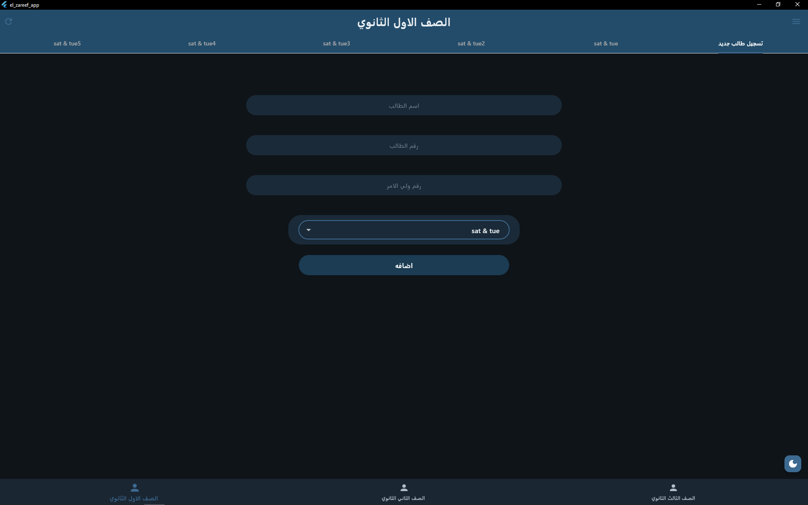
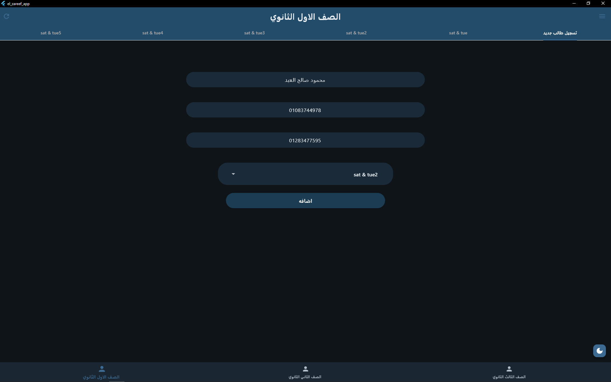
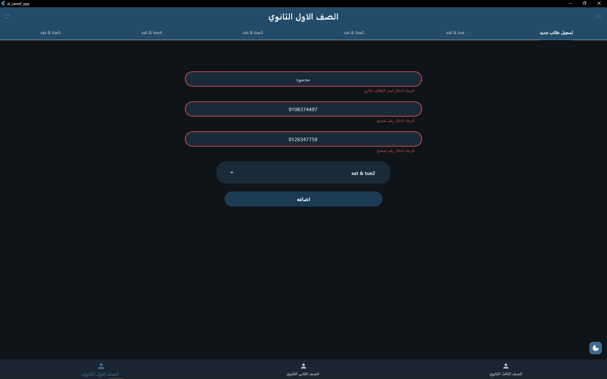
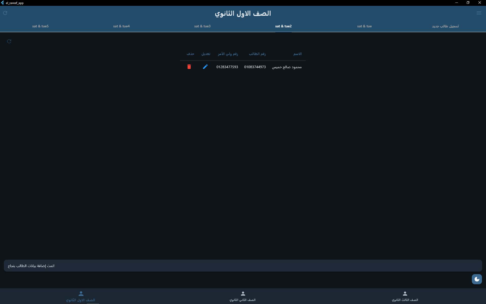
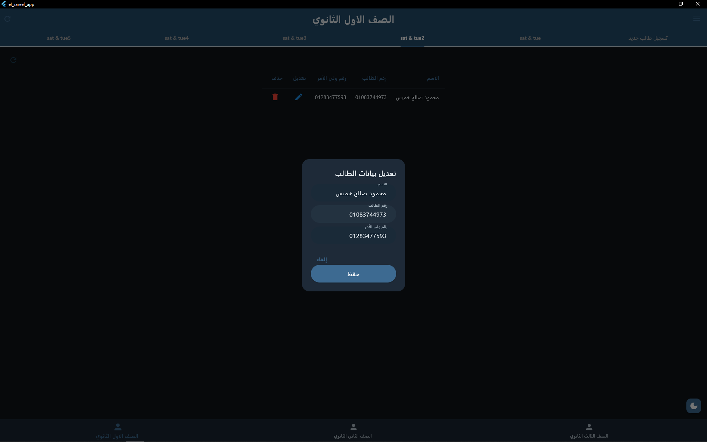
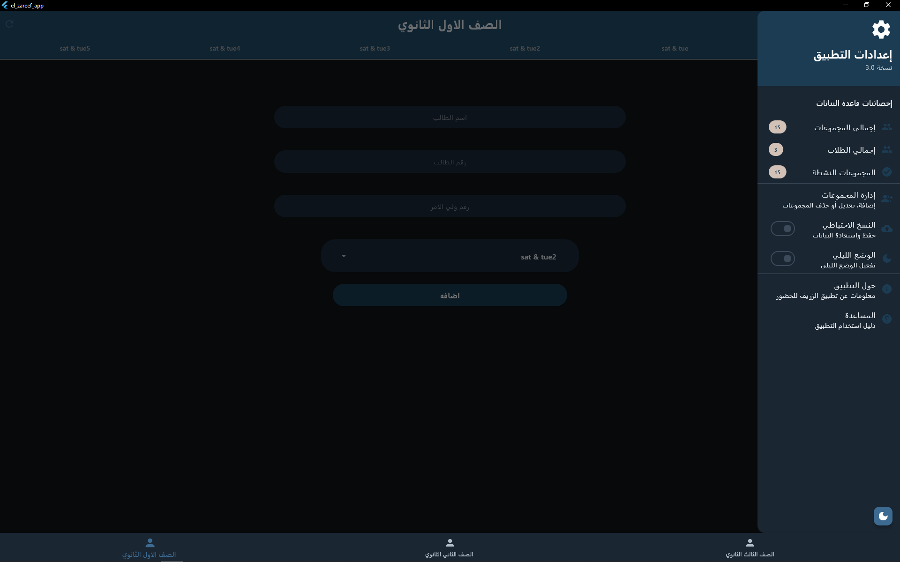
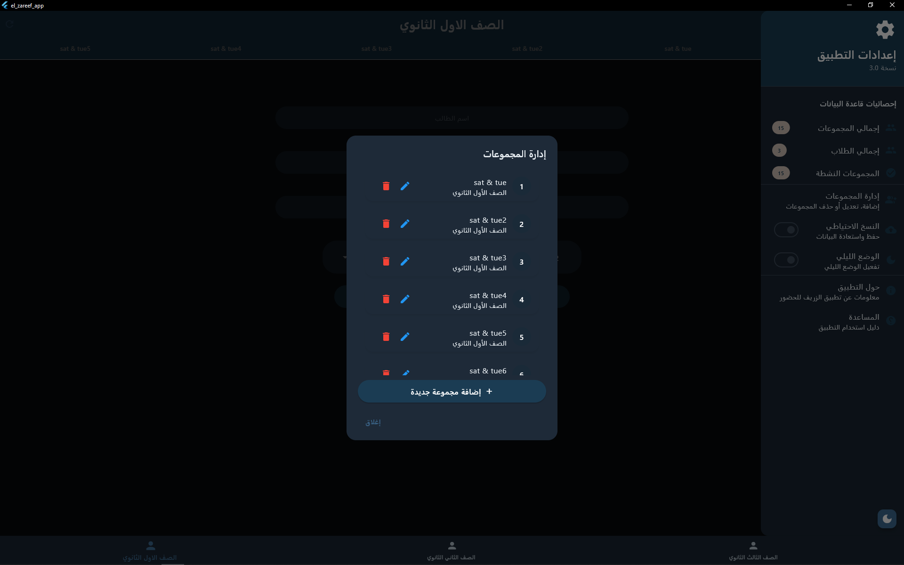
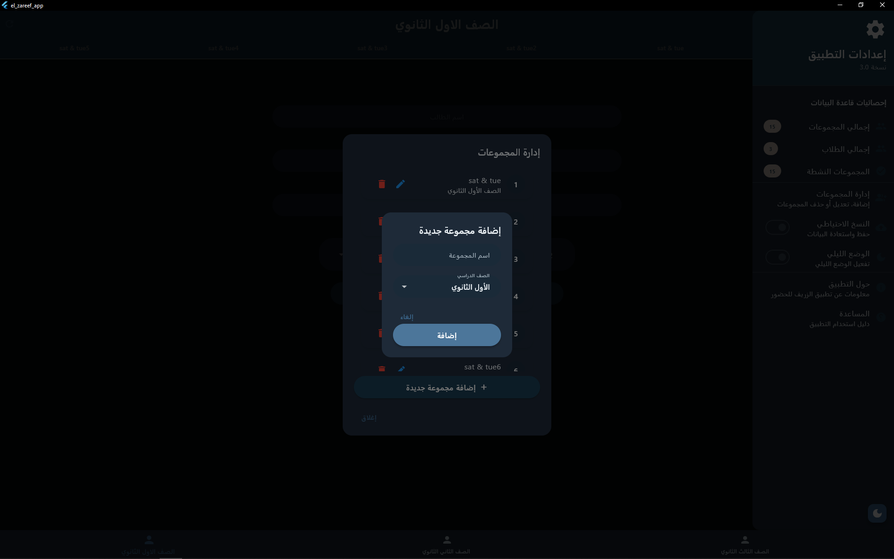
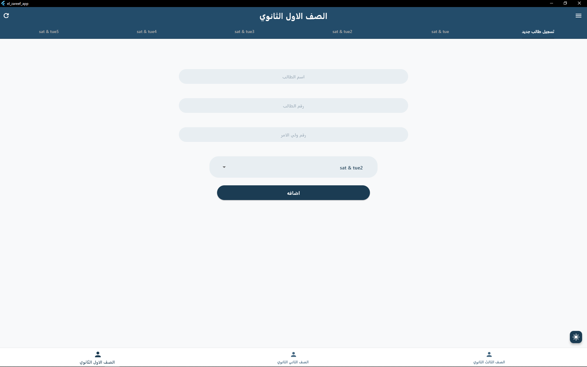

# 🎓 Student Attendance System

A comprehensive **Flutter desktop application** designed for managing student attendance across high school grades in Arabic educational institutions. Built with modern Flutter architecture and SQLite database integration for efficient student data management.

## ✨ Key Features

### 📚 Multi-Grade Management
- Support for 3 high school grades (الصف الأول/الثاني/الثالث الثانوي)
- 15 predefined study groups (5 groups per grade)
- Standardized "Saturday & Tuesday" schedule system

### 🎨 User Experience
- **Bilingual Interface**: Arabic RTL layout with English technical elements
- **Responsive Design**: Optimized for desktop with mobile-friendly breakpoints
- **Dark/Light Theme**: System-aware theme switching with user preferences
- **Intuitive Navigation**: Tab-based interface for seamless grade and group management

### 💾 Robust Data Management
- **SQLite Database**: Local storage with foreign key constraints and cascade operations
- **Unified Schema**: Migrated architecture supporting groups and students relationship
- **Data Persistence**: Automatic state preservation across app sessions
- **Validation System**: Arabic name validation and Egyptian phone number formatting

## 🚀 Getting Started

### Prerequisites
- Flutter SDK (≥3.9.2)
- Windows development environment
- SQLite support

### Installation

1. **Clone the repository**
   ```bash
   git clone https://github.com/mahmoudasal/Student-Attendance-System.git
   cd Student-Attendance-System
   ```

2. **Install dependencies**
   ```bash
   flutter pub get
   ```

3. **Run the application**
   ```bash
   flutter run -d windows
   ```

## 🏗️ Architecture

### Project Structure
```
lib/
├── models/              # Data models (Student, Group)
├── services/            # Database and business logic
├── screens/             # UI components and pages
├── theme/              # Theme management and styling
└── constants.dart      # App-wide constants and configurations
```

### Key Components
- **UnifiedSqlDb**: Singleton database management
- **ThemeProvider**: Hive-based theme persistence
- **NavigatorScreen**: Main navigation with PageView
- **UnifiedSectionPage**: Grade-specific tab management

## 📱 Screenshots

### Main Navigation & Grade Selection
<div align="center">
  
  
</div>

### Student Registration & Data Management
<div align="center">
  
  
</div>

### Theme Management & Settings
<div align="center">
  
  
</div>

### Group Management & Advanced Features
<div align="center">
  
  
</div>

### light Mode & Latest Feature
<div align="center">
  
  
</div>

## 🔧 Technical Details

### Dependencies
- `flutter_screenutil`: Responsive design
- `sqflite`: SQLite database
- `hive`: Local preferences storage
- `flutter_svg`: SVG asset support

### Database Schema
- **Groups Table**: id, name, grade, schedule, isActive
- **Students Table**: id, group_id, name, sPhone, gPhone, created_at

## 🤝 Contributing

1. Fork the repository
2. Create your feature branch (`git checkout -b feature/AmazingFeature`)
3. Commit your changes (`git commit -m 'Add some AmazingFeature'`)
4. Push to the branch (`git push origin feature/AmazingFeature`)
5. Open a Pull Request

## 📄 License

This project is licensed under the MIT License - see the [LICENSE](LICENSE) file for details.

## 👨‍💻 Author

**Mahmoud Asal**
- GitHub: [@mahmoudasal](https://github.com/mahmoudasal)

## 🎯 Target Audience

Perfect for:
- **Educational Institutions**: High schools managing student attendance
- **Arabic Schools**: RTL interface with Arabic text support
- **Desktop Environments**: Windows-optimized Flutter desktop application
